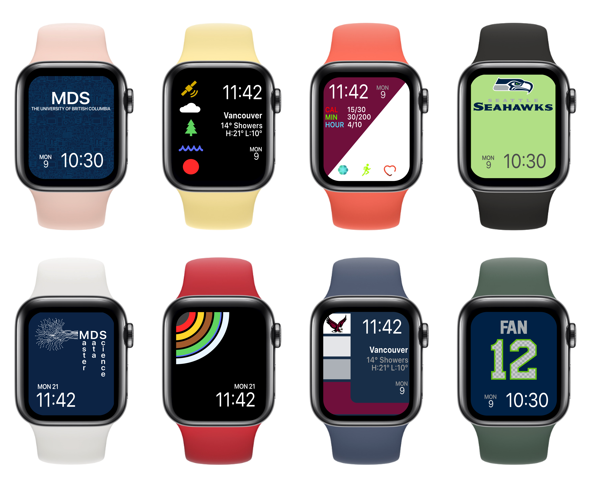

This repository contains images I've made for personal use with an Apple Watch.  

## How to use
1. Save the image(s) to your Apple `Photos` application;
2. Select the image(s) and tap the `Share` button in the bottom left corner;
3. Swipe from right to left to find and tap `Create Watch Face`;
3. Choose which type of face you’d like to create;
4. Tap `Add` at the top of your screen; and,
5. Your new face should show up on your Watch right away.

*I do not own any of the logos or images used as inspiration for these designs, nor do I own the Apple Watch design. These resources are being released under CC0.*
